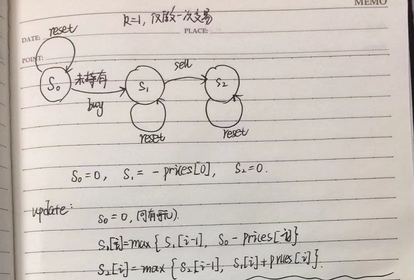
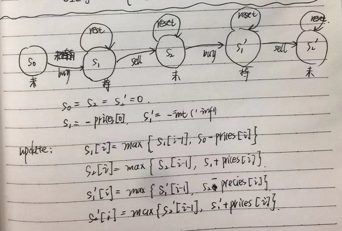

[TOC]


# 309. Best Time to Buy and Sell Stock with Cooldown

Medium

Say you have an array for which the *i*th element is the price of a given stock on day *i*.

Design an algorithm to find the maximum profit. You may complete as many transactions as you like (ie, buy one and sell one share of the stock multiple times) with the following restrictions:

- You may not engage in multiple transactions at the same time (ie, you must sell the stock before you buy again).
- After you sell your stock, you cannot buy stock on next day. (ie, cooldown 1 day)

**Example:**

```
Input: [1,2,3,0,2]
Output: 3 
Explanation: transactions = [buy, sell, cooldown, buy, sell]
```

#  思路：

 题目中有三条规则，1. 先买后卖。2.手上只能购买一只股票。3. 卖完第二天不能马上重新进行购买。

可以发生的动作为：1.购买。2.rest不做任何操作。3.抛售

可以处的状态：1.持有。2.未持有

可以转化后成为下图（state machine）：


其中S0代表未持有股票，当前可以rest，也可以购买。S1代表持有状态，可以rest，也可以抛售。S2也是未持有状态，为什么单独设置S2，不让S1 的sell直接指向S0，是为了保证抛售后必须cool down一天。我们要求的就是S0和S2状态下，最大化的利润，因为最后未持有肯定比持有的profit高。

S0[i]，S2[i]代表第i天，处于未持有目前手上的最大化利润。S1[i]代表第i天，处于持有状态下目前手上的最大化利润。他们之间的转化关系可以通过上图来定义：

```
s0[i] = max(s0[i - 1], s2[i - 1]); // Stay at s0, or rest from s2
s1[i] = max(s1[i - 1], s0[i - 1] - prices[i]); // Stay at s1, or buy from s0
s2[i] = s1[i - 1] + prices[i]; // Only one way from s1
```

可以看到上述迭代过程中，仅有3个variable要存储，所以$O(1)$的空间复杂度，$O(n)$的时间复杂度。而他们的初始状态如何定义？第一天我们给定他们初值，

```
s0[0] = 0; // At the start, you don't have any stock if you just rest
s1[0] = -prices[0]; // After buy, you should have -prices[0] profit. Be positive!
s2[0] = INT_MIN; // Lower base case
```


参考：

1. https://leetcode.com/problems/best-time-to-buy-and-sell-stock-with-cooldown/discuss/75928/Share-my-DP-solution-(By-State-Machine-Thinking)

1. https://leetcode.com/problems/best-time-to-buy-and-sell-stock-with-transaction-fee/discuss/108870/Most-consistent-ways-of-dealing-with-the-series-of-stock-problems

# 解题：


```python
class Solution:
    def maxProfit(self, prices):
        """
        :type prices: List[int]
        :rtype: int
        """
        if not prices:
            return 0
        s0, s2 = 0, 0
        s1 = - prices[0]
        
        for i in range(1, len(prices)):
            temp0 = max(s0, s2)
            temp1 = max(s1, s0 - prices[i])
            temp2 = s1 + prices[i]
            
            s0 = temp0
            s1 = temp1
            s2 = temp2
        
        return max(s0, s2)
            
```

其他解题：

```python
class Solution:
    def maxProfit(self, prices):
        """
        :type prices: List[int]
        :rtype: int
        """
        if not prices:
            return 0
        s0, s2 = 0, 0
        s1 = - float('inf')
        
        for i in range(0, len(prices)):

            temp0 = max(s0, s2)
            temp1 = max(s1, s0 - prices[i])
            temp2 = s1 + prices[i]
            
            s0 = temp0
            s1 = temp1
            s2 = temp2
        
        return max(s0, s2)
```

# 714. [Best Time to Buy and Sell Stock with Transaction Fee](https://leetcode.com/problems/best-time-to-buy-and-sell-stock-with-transaction-fee/submissions/)

Medium

Say you have an array for which the *i*th element is the price of a given stock on day *i*.

Design an algorithm to find the maximum profit. You may complete as many transactions as you like (ie, buy one and sell one share of the stock multiple times) with the following restrictions:

- You may not engage in multiple transactions at the same time (ie, you must sell the stock before you buy again).
- After you sell your stock, you cannot buy stock on next day. (ie, cooldown 1 day)

**Example:**

```
Input: [1,2,3,0,2]
Output: 3 
Explanation: transactions = [buy, sell, cooldown, buy, sell]
```

# 思路：

和上一题的解题思路相同，只不过这里的未持有状态变为1个，仅仅有S0. state machine图如下：


# 解题：


```python
class Solution:
    def maxProfit(self, prices, fee):
        """
        :type prices: List[int]
        :type fee: int
        :rtype: int
        """
        if not prices:
            return 0
        s0 = 0
        s1 = -prices[0]
        
        for i in range(1, len(prices)):
            temp0 = max(s0, s1 + prices[i] - fee)
            temp1 = max(s1, s0 - prices[i])
            
            s0 = temp0
            s1 = temp1
            
        return s0
```

其他解题：

```python
class Solution:
    def maxProfit(self, prices, fee):
        """
        :type prices: List[inf]
        :type fee: int
        :rtype: int
        """
        if not prices:
            return 0
        s0 = 0
        s1 = -float('int')
        
        for i in range(0, len(prices)):
            temp0 = max(s0, s1 + prices[i] - fee)
            temp1 = max(s1, s0 - prices[i])
            
            s0 = temp0
            s1 = temp1
            
        return s0
```


# [122. Best Time to Buy and Sell Stock II](https://leetcode.com/problems/best-time-to-buy-and-sell-stock-ii/)

Easy

Say you have an array for which the *i*th element is the price of a given stock on day *i*.

Design an algorithm to find the maximum profit. You may complete as many transactions as you like (i.e., buy one and sell one share of the stock multiple times).

**Note:** You may not engage in multiple transactions at the same time (i.e., you must sell the stock before you buy again).

**Example 1:**

```
Input: [7,1,5,3,6,4]
Output: 7
Explanation: Buy on day 2 (price = 1) and sell on day 3 (price = 5), profit = 5-1 = 4.
             Then buy on day 4 (price = 3) and sell on day 5 (price = 6), profit = 6-3 = 3.
```

**Example 2:**

```
Input: [1,2,3,4,5]
Output: 4
Explanation: Buy on day 1 (price = 1) and sell on day 5 (price = 5), profit = 5-1 = 4.
             Note that you cannot buy on day 1, buy on day 2 and sell them later, as you are
             engaging multiple transactions at the same time. You must sell before buying again.
```

**Example 3:**

```
Input: [7,6,4,3,1]
Output: 0
Explanation: In this case, no transaction is done, i.e. max profit = 0.
```

# 思路：

和上一题的解题思路相同，只不过这里在出售的时候，不考虑手续费用。可以交易任意次次数。

# 解题：


```python
class Solution:
    def maxProfit(self, prices, fee):
        """
        :type prices: List[int]
        :rtype: int
        """
        if not prices:
            return 0
        s0 = 0
        s1 = -prices[0]
        
        for i in range(1, len(prices)):
            temp0 = max(s0, s1 + prices[i])
            temp1 = max(s1, s0 - prices[i])
            
            s0 = temp0
            s1 = temp1
            
        return s0
```

其他解题：

```python
class Solution:
    def maxProfit(self, prices, fee):
        """
        :type prices: List[inf]
        :rtype: int
        """
        if not prices:
            return 0
        s0 = 0
        s1 = -float('inf')
        
        for i in range(0, len(prices)):
            temp0 = max(s0, s1 + prices[i])
            temp1 = max(s1, s0 - prices[i])
            
            s0 = temp0
            s1 = temp1
            
        return s0
```


# 

# 121. Best Time to Buy and Sell Stock

Easy

Say you have an array for which the *i*th element is the price of a given stock on day *i*.

If you were only permitted to complete at most one transaction (i.e., buy one and sell one share of the stock), design an algorithm to find the maximum profit.

Note that you cannot sell a stock before you buy one.

**Example 1:**

```
Input: [7,1,5,3,6,4]
Output: 5
Explanation: Buy on day 2 (price = 1) and sell on day 5 (price = 6), profit = 6-1 = 5.
             Not 7-1 = 6, as selling price needs to be larger than buying price.
```

**Example 2:**

```
Input: [7,6,4,3,1]
Output: 0
Explanation: In this case, no transaction is done, i.e. max profit = 0.
```

# 思路：


对每天的价格遍历一遍，实时更新最小值，并每天的价格和当前最小值做差，和当前最大的profit取max。因为最大的利润会在valley和peak之差出现。我们不能反过来不停的实时更新peak，拿当前的价格和peak做差，因为股票是先购买，再抛售，所以只能先找valley，再一个一个试peak。


# 解题：


```python
class Solution:
    def maxProfit(self, prices):
        """
        :type prices: List[int]
        :rtype: int
        """
        valley = float('inf')
        profit = 0
        
        for i, price in enumerate(prices):
            valley = min(valley, price)
            profit = max(profit, price - valley)
            
        return profit
            
        
```

其他解题：按照上边一题中的思路来解答，仅仅进行一次交易（上一题中允许随意次交易）。我们可以根据本题画出如下的state machine图：



```python
class Solution:
    def maxProfit(self, prices):
        """
        :type prices: List[int]
        :rtype: int
        """
        
        if not prices:
            return 0
        
        s0 = 0
        s1 = -prices[0]
        s2 = 0
        
        for i in range(1, len(prices)):
            s2 = max(s1 + prices[i],s2)
            s1 = max(s0 - prices[i], s1)
        return s2
            
```


# [123. Best Time to Buy and Sell Stock III](https://leetcode.com/problems/best-time-to-buy-and-sell-stock-iii/)

Hard

Say you have an array for which the *i*th element is the price of a given stock on day *i*.

Design an algorithm to find the maximum profit. You may complete at most *two* transactions.

**Note:** You may not engage in multiple transactions at the same time (i.e., you must sell the stock before you buy again).

**Example 1:**

```
Input: [3,3,5,0,0,3,1,4]
Output: 6
Explanation: Buy on day 4 (price = 0) and sell on day 6 (price = 3), profit = 3-0 = 3.
             Then buy on day 7 (price = 1) and sell on day 8 (price = 4), profit = 4-1 = 3.
```

**Example 2:**

```
Input: [1,2,3,4,5]
Output: 4
Explanation: Buy on day 1 (price = 1) and sell on day 5 (price = 5), profit = 5-1 = 4.
             Note that you cannot buy on day 1, buy on day 2 and sell them later, as you are
             engaging multiple transactions at the same time. You must sell before buying again.
```

**Example 3:**

```
Input: [7,6,4,3,1]
Output: 0
Explanation: In this case, no transaction is done, i.e. max profit = 0.
```

# 思路：



# 解题：


```python
class Solution:
    def maxProfit(self, prices):
        """
        :type prices: List[int]
        :rtype: int
        """
        s0 = s2 = s2b = 0
        s1 = s1b = -float('inf') # 代表预设最差的决定
        
        for i in range(len(prices)):
            
            s2b = max(s2b, s1b + prices[i])
            s1b = max(s1b, s2 -  prices[i])
            s2  = max(s2,  s1 +  prices[i])
            s1  = max(s1,  s0 -  prices[i])
            
        return s2b
            
        
```


# [188. Best Time to Buy and Sell Stock IV](https://leetcode.com/problems/best-time-to-buy-and-sell-stock-iv/#/description)

Hard

Say you have an array for which the *i*th element is the price of a given stock on day *i*.

Design an algorithm to find the maximum profit. You may complete at most **k** transactions.

**Note:**
You may not engage in multiple transactions at the same time (ie, you must sell the stock before you buy again).

**Example 1:**

```
Input: [2,4,1], k = 2
Output: 2
Explanation: Buy on day 1 (price = 2) and sell on day 2 (price = 4), profit = 4-2 = 2.
```

**Example 2:**

```
Input: [3,2,6,5,0,3], k = 2
Output: 7
Explanation: Buy on day 2 (price = 2) and sell on day 3 (price = 6), profit = 6-2 = 4.
             Then buy on day 5 (price = 0) and sell on day 6 (price = 3), profit = 3-0 = 3.
```

# 思路：

思路与上题相同，只不过把k=2扩展到更多的。另外需要注意一共有n天，可能完成的购买和抛售最多 n/2次，因此当k>n/2时，可以理解为没有对交易次数做任何限制。

# 解题：


```python
class Solution:
    def maxProfit(self, k, prices):
        """
        :type k: int
        :type prices: List[int]
        :rtype: int
        """
        if k ==0 or len(prices) ==0:
            return 0
        
        # 如果k过大，相当于对k没有限制
        if k > len(prices)/2:
            s0 = 0
            s1 = -float('inf')
            for i in range(0, len(prices)):
                temp0 = max(s0, s1 + prices[i])
                temp1 = max(s1, s0 - prices[i])
                
                s0 = temp0
                s1 = temp1
            return s0
        
        
        # k < n/2
        s0 = 0
        s1 = [-float('inf')] * k            #第k次交易中，抛售后的最大化利益
        s2 = [0] * k                        #第k次交易中，购买后的最大化利益
        
        
        for _, price in enumerate(prices):

            for i in range(k)[::-1]:
                
                if i == 0:
                    s2[0] = max(s2[0], s1[0] + price)
                    s1[0] = max(s1[0], 0 - price)
                else:
                    s2[i] = max(s2[i], s1[i] + price)
                    s1[i] = max(s1[i], s2[i-1] - price)
        return s2[-1]
```


