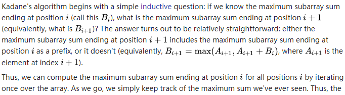

# 53. Maximum Subarray

Easy

Given an integer array `nums`, find the contiguous subarray (containing at least one number) which has the largest sum and return its sum.

**Example:**

```
Input: [-2,1,-3,4,-1,2,1,-5,4],
Output: 6
Explanation: [4,-1,2,1] has the largest sum = 6.
```

**Follow up:**

If you have figured out the O(*n*) solution, try coding another solution using the divide and conquer approach, which is more subtle.

# 思路：

参考别人的做法，

- Kadane算法：

其中核心式子如上，为动态规划的核心？？

# 解题：


```python
XXX
```

极简的解题：

```python
class Solution:
    def maxSubArray(self, nums):
        """
        :type nums: List[int]
        :rtype: int
        """
        if not nums:
            return None
        
        for i in range(1,len(nums)):
            if nums[i-1] >0:
                nums[i] = nums[i] + nums[i-1]
        return max(nums)
```

