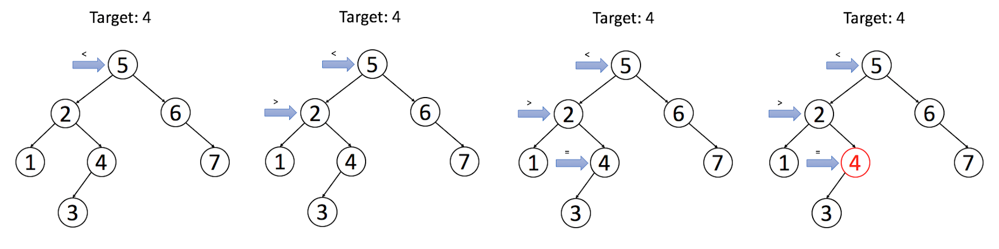

[TOC]


# [98. Validate Binary Search Tree](https://leetcode.com/problems/validate-binary-search-tree/)

Medium

Given a binary tree, determine if it is a valid binary search tree (BST).

Assume a BST is defined as follows:

- The left subtree of a node contains only nodes with keys **less than** the node's key.
- The right subtree of a node contains only nodes with keys **greater than** the node's key.
- Both the left and right subtrees must also be binary search trees.

**Example 1:**

```
Input:
    2
   / \
  1   3
Output: true
```

**Example 2:**

```
    5
   / \
  1   4
     / \
    3   6
Output: false
Explanation: The input is: [5,1,4,null,null,3,6]. The root node's value
             is 5 but its right child's value is 4.
```

# 思路：

递归式思路：判断一个binary tree是否为 binary search tree，对于每一个节点需要满足什么条件？ 1.当前节点的值必须要大于左子节点的val，同时要小于右节点的val。但是满足这个条件的不一定是binary search tree。真正的条件应当是，一个子节点，必须小于右边树当中的所有元素，同时大于左边树当中的所有元素。

迭代式思路：BFS + deque 或者 DFS + stack

或者考虑使用inorder traversal (left, root, right)对树进行遍历。Other approach to solve this problem would be to use inorder traversal properties where previous element in output would always be lesser than the current output.。具体可以在遍历时，每一步取一个max(previous), 并判断其是否小于当前值。inorder traversal用stack实现。

# 解题：

递归式思路：

```python
# Definition for a binary tree node.
# class TreeNode:
#     def __init__(self, x):
#         self.val = x
#         self.left = None
#         self.right = None

class Solution:
    def isValidBST(self, root):
        """
        :type root: TreeNode
        :rtype: bool
        """
        if not root:
            return True
        
        return self.helper(root, None, None) 
    
    def helper(self, root, upper, lower):
        if not root:
            return True
        
        left = True
        right = True

        if not upper is None:
            left = root.val < upper
            
        if not lower is None:
            right = root.val > lower
            

            
        if not (right and left):
            return False

        return self.helper(root.right, upper, root.val) and self.helper(root.left, root.val, lower)

    
        
        
```

其他解题（BFS iterative with deque）：

```python
# Definition for a binary tree node.
# class TreeNode:
#     def __init__(self, x):
#         self.val = x
#         self.left = None
#         self.right = None

class Solution:
    def isValidBST(self, root):
        """
        :type root: TreeNode
        :rtype: bool
        """
        # BFS iterative with deque
        
        if root is None:
            return True
        
        dq = collections.deque([(root, None, None),])
        
        while dq:
            
            node, upper, lower = dq.popleft()
            
            if node is None:
                continue
            
            
            left = True
            right = True
                   
            if not upper is None:
                left = node.val < upper
            
            if not lower is None:
                right = node.val > lower
            
            # 如果当前点满足条件，则继续判断，否则直接判断为非binary search tree
            if right and left:
                dq.append((node.left, node.val, lower))
                dq.append((node.right,upper, node.val))
            else:
                return False
            

            
        return True
    
        
        
```

其他解题（DFS iteratively + stack ）：

```python
# Definition for a binary tree node.
# class TreeNode:
#     def __init__(self, x):
#         self.val = x
#         self.left = None
#         self.right = None

class Solution:
    def isValidBST(self, root):
        """
        :type root: TreeNode
        :rtype: bool
        """
        # DFS iterative with stack
        
        if root is None:
            return True
        
        stack = [(root, None, None)]
        
        while stack:
            
            node, upper, lower = stack.pop()
            
            if node is None:
                continue
            
            
            left = node.val > lower if not (lower is None) else True
            right = node.val < upper if not (upper is None) else True
            
            if left and right:
                stack.append((node.left, node.val, lower))
                stack.append((node.right, upper, node.val))
            else:
                return False
            
        return True
        
        
    
        
        
```


InOrder traversal 

```python
# Definition for a binary tree node.
# class TreeNode:
#     def __init__(self, x):
#         self.val = x
#         self.left = None
#         self.right = None

class Solution:
    def isValidBST(self, root):
        """
        :type root: TreeNode
        :rtype: bool
        """
        # inOrder traversal with stack
        
        stack = []
        
        pre_max = - float('inf')
        
        while stack or root:
            if not root is None:
                stack.append(root)
                root = root.left
                
            else:
                node = stack.pop()
                if node.val <= pre_max:
                    return False
                else:
                    pre_max = node.val
                root = node.right
        return True

```


# [173. Binary Search Tree Iterator](https://leetcode.com/problems/binary-search-tree-iterator/)

Medium

mplement an iterator over a binary search tree (BST). Your iterator will be initialized with the root node of a BST.

Calling `next()` will return the next smallest number in the BST.

 


**Example:**

****

```
BSTIterator iterator = new BSTIterator(root);
iterator.next();    // return 3
iterator.next();    // return 7
iterator.hasNext(); // return true
iterator.next();    // return 9
iterator.hasNext(); // return true
iterator.next();    // return 15
iterator.hasNext(); // return true
iterator.next();    // return 20
iterator.hasNext(); // return false
```

 

**Note:**

- `next()` and `hasNext()` should run in average O(1) time and uses O(*h*) memory, where *h* is the height of the tree.
- You may assume that `next()` call will always be valid, that is, there will be at least a next smallest number in the BST when `next()` is called.

# 思路：

InOrder search 在binary search tree中是一种重要的遍历方法，可以直接得到从小到大的排序。

# 解题：


```python
# Definition for a binary tree node.
# class TreeNode:
#     def __init__(self, x):
#         self.val = x
#         self.left = None
#         self.right = None

class Solution:
    def isValidBST(self, root):
        """
        :type root: TreeNode
        :rtype: bool
        """
        if not root:
            return True
        
        return self.helper(root, None, None) 
    
    def helper(self, root, upper, lower):
        if not root:
            return True
        
        left = True
        right = True

        if not upper is None:
            left = root.val < upper
            
        if not lower is None:
            right = root.val > lower
            

            
        if not (right and left):
            return False

        return self.helper(root.right, upper, root.val) and self.helper(root.left, root.val, lower)

    
        
        
```


# [700. Search in a Binary Search Tree](https://leetcode.com/problems/search-in-a-binary-search-tree/)

Easy

Given the root node of a binary search tree (BST) and a value. You need to find the node in the BST that the node's value equals the given value. Return the subtree rooted with that node. If such node doesn't exist, you should return NULL.

For example, 

```
Given the tree:
        4
       / \
      2   7
     / \
    1   3

And the value to search: 2
```

You should return this subtree:

```
      2     
     / \   
    1   3
```

In the example above, if we want to search the value `5`, since there is no node with value `5`, we should return `NULL`.

Note that an empty tree is represented by `NULL`, therefore you would see the expected output (serialized tree format) as `[]`, not `null`.

# 思路：

According to the property of BST, for each node:

1. return the node if the target value is **\*equal to*** the value of the node;
2. continue searching in the **\*left*** subtree if the target value is **\*less than*** the value of the node;
3. continue searching in the **\*right*** subtree if the target value is **\*larger than*** the value of the node.

Let's go through an example: we search for **\*target = 4*** in the BST above.



Please implement the search operation by yourself in our following exercise. You can do it recursively or iteratively. Try to analyze the time complexity and space complexity as well. We will provide a solution after that.

# 解题：

iteratively with Space complexity $O(1)$, time complexity $O(h)$, h is the height of the tree.

```python
# Definition for a binary tree node.
# class TreeNode:
#     def __init__(self, x):
#         self.val = x
#         self.left = None
#         self.right = None

class Solution:
    def searchBST(self, root, val):
        """
        :type root: TreeNode
        :type val: int
        :rtype: TreeNode
        """

        
        while root and root.val != val:
            root = root.left if root.val > val else root.right
        return root
```


recursively : with Space complexity $O(1)$, time complexity $O(h)$, h is the height of the tree.

```python
# Definition for a binary tree node.
# class TreeNode:
#     def __init__(self, x):
#         self.val = x
#         self.left = None
#         self.right = None

class Solution:
    def searchBST(self, root, val):
        """
        :type root: TreeNode
        :type val: int
        :rtype: TreeNode
        """
        self.val = val
        return self.helper(root)

        

    def helper(self,node):
        
        if node and node.val != self.val:
            return self.helper(node.left if node.val > self.val else node.right )
        else:
            return node
       
```


# [701. Insert into a Binary Search Tree](https://leetcode.com/problems/insert-into-a-binary-search-tree/)

Medium

Given the root node of a binary search tree (BST) and a value to be inserted into the tree, insert the value into the BST. Return the root node of the BST after the insertion. It is guaranteed that the new value does not exist in the original BST.

Note that there may exist multiple valid ways for the insertion, as long as the tree remains a BST after insertion. You can return any of them.

For example, 

```
Given the tree:
        4
       / \
      2   7
     / \
    1   3
And the value to insert: 5
```

You can return this binary search tree:

```
         4
       /   \
      2     7
     / \   /
    1   3 5
```

This tree is also valid:

```
         5
       /   \
      2     7
     / \   
    1   3
         \
          4
```

# 思路：

Another common operation in BST is to `insert a new node`. There are many different strategies for insertion. We only talk about a typical insertion strategy which minimizes the changes. The main idea is to find out a proper leaf position for the target node and then insert the node as a leaf. Therefore, insertion will begin as a search.

Similar to our search strategy, for each node, we will:

1. search the left or right subtrees according to the relation of the value of the node and the value of our target node;
2. repeat STEP 1 until reaching an external node;
3. add the new node as its left or right child depending on the relation of the value of the node and the value of our target node.

In this way, we add a new node and maintain the property of BST.


# 解题：

iteratively with Space complexity $O(1)$, time complexity $O(h)$, h is the height of the tree.

```python
# Definition for a binary tree node.
# class TreeNode:
#     def __init__(self, x):
#         self.val = x
#         self.left = None
#         self.right = None

class Solution:
    def insertIntoBST(self, root, val):
        """
        :type root: TreeNode
        :type val: int
        :rtype: TreeNode
        """
        
        # first search to a leaf node
        # then insert the target node to the leaf node
        
        node = root
        while node:
            
            if node.val > val:
                if not node.left:
                    node.left = TreeNode(val)
                    break
                node = node.left  
            else:
                if not node.right:
                    node.right = TreeNode(val)
                    break
                node = node.right

        return root
```


recursively : with Space complexity $O(1)$, time complexity $O(h)$, h is the height of the tree.

```python
# Definition for a binary tree node.
# class TreeNode:
#     def __init__(self, x):
#         self.val = x
#         self.left = None
#         self.right = None

class Solution:
    def insertIntoBST(self, root, val):
        """
        :type root: TreeNode
        :type val: int
        :rtype: TreeNode
        """
        self.val = val
        node = root
        self.helper(node)
        return root
        
        
    def helper(self, node):

        
        if node.val > self.val :
            if not node.left:
                node.left = TreeNode(self.val )
            else:
                self.helper(node.left)
                
        else:
            if not node.right:
                node.right = TreeNode(self.val )
            else:
                self.helper(node.right)

       
```


# [450. Delete Node in a BST](https://leetcode.com/problems/delete-node-in-a-bst/)

Medium

Given a root node reference of a BST and a key, delete the node with the given key in the BST. Return the root node reference (possibly updated) of the BST.

Basically, the deletion can be divided into two stages:

1. Search for a node to remove.
2. If the node is found, delete the node.


**Note:** Time complexity should be O(height of tree).

**Example:**

```
root = [5,3,6,2,4,null,7]
key = 3

    5
   / \
  3   6
 / \   \
2   4   7

Given key to delete is 3. So we find the node with value 3 and delete it.

One valid answer is [5,4,6,2,null,null,7], shown in the following BST.

    5
   / \
  4   6
 /     \
2       7

Another valid answer is [5,2,6,null,4,null,7].

    5
   / \
  2   6
   \   \
    4   7
```

# 思路：

Deletion is more complicated than the two operations we mentioned before. There are also many different strategies for deletion. We are going to introduce one of them which minimizes the changes. First stage is to find the target node. Second stage is to replace the target node with a proper child. According to the number of its children, we should consider 4different cases:

- node doesn't have left or right - return null
- node only has left subtree- return the left subtree
- node only has right subtree- return the right subtree
- node has both left and right - find the minimum value in the right subtree, set that value to the currently found node, then recursively delete the minimum value in the right subtree


# 解题：


recursively : with Space complexity $O(1)$, time complexity $O(h)$, h is the height of the tree.

```python

```

