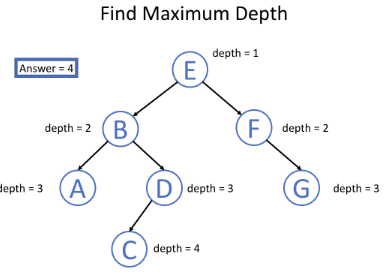

# [Binary Tree](https://leetcode.com/explore/learn/card/data-structure-tree/134/traverse-a-tree/992/)

## Traverse a Tree

遍历的方法主要分三种如下，分别是Pre-order Traversal，In-order Traversal，Post-order Traversal。他们的主要原则都是，每当遇到一个节点的时候，该节点自身作为root，分别采用不同的顺序来进行存储。

- Pre-order Traversal (root, left, right)


Given a binary tree, return the *preorder* traversal of its nodes' values.

**Example:**

```
Input: [1,null,2,3]
   1
    \
     2
    /
   3

Output: [1,2,3]
```

**Follow up:** Recursive solution is trivial, could you do it iteratively?


**iteratively 解决方案一**

```python
# Definition for a binary tree node.
# class TreeNode:
#     def __init__(self, x):
#         self.val = x
#         self.left = None
#         self.right = None

class Solution:
    def preorderTraversal(self, root):
        """
        :type root: TreeNode
        :rtype: List[int]
        """
        result = []
        # 先考虑root节点
        stack = [root]
        
        while stack:
            # 利用栈的先进后出，弹出末尾的node
            node = stack.pop()
            if node:
                # 因为是pre-order，在traversal时，要先存储root节点的值
                result.append(node.val)
                stack.append(node.right)
                # 先进后出，left最后加入stack，下轮首先弹出左节点，符合pre-order的顺序。
                stack.append(node.left)
        return result
```


**iteratively 解决方案二** （这种方案能够较好的扩展到In-Order和Post-Order的Trversal中）

```python
# Definition for a binary tree node.
# class TreeNode:
#     def __init__(self, x):
#         self.val = x
#         self.left = None
#         self.right = None

class Solution:
    def preorderTraversal(self, root):
        """
        :type root: TreeNode
        :rtype: List[int]
        """
        ans = []
        stack = []
        while stack or root:
            if root:
                stack.append(root)
                ans.append(root.val)
                root = root.left
            else:
                tmpNode = stack.pop()
                root = tmpNode.right
        return ans
```


**recursively 解决方案**

```python
# Definition for a binary tree node.
# class TreeNode:
#     def __init__(self, x):
#         self.val = x
#         self.left = None
#         self.right = None

class Solution:
    def postorderTraversal(self, root):
        """
        :type root: TreeNode
        :rtype: List[int]
        """
        ans = []
        self.helper(ans,root)
        return ans
    
    def helper(self,ans,root):
        if root:
        	ans.append(root.val)
            self.helper(ans,root.left)
            
            self.helper(ans,root.right)
            
```


- In-order Traversal (left, root, right)


Given a binary tree, return the *inorder* traversal of its nodes' values.

**Example:**

```
Input: [1,null,2,3]
   1
    \
     2
    /
   3

Output: [1,3,2]
```

**Follow up:** Recursive solution is trivial, could you do it iteratively?


**iteratively 解决方案**

```python
class Solution:
    def inorderTraversal(self, root):
        """
        :type root: TreeNode
        :rtype: List[int]
        """
        ans = []
        stack = []
        while stack or root:
            if root:
                stack.append(root)
                
                root = root.left
            else:
                tmpNode = stack.pop()
                ans.append(tmpNode.val)
                root = tmpNode.right
                
        return ans
```

**recursively 解决方案**

```python
# Definition for a binary tree node.
# class TreeNode:
#     def __init__(self, x):
#         self.val = x
#         self.left = None
#         self.right = None

class Solution:
    def postorderTraversal(self, root):
        """
        :type root: TreeNode
        :rtype: List[int]
        """
        ans = []
        self.helper(ans,root)
        return ans
    
    def helper(self,ans,root):
        if root:
            self.helper(ans,root.left)
            ans.append(root.val)
            self.helper(ans,root.right)
            
```


- Post-order Traversal (left, right, root)


Given a binary tree, return the *postorder* traversal of its nodes' values.

**Example:**

```
Input: [1,null,2,3]
   1
    \
     2
    /
   3

Output: [3,2,1]
```

**Follow up:** Recursive solution is trivial, could you do it iteratively?


**iteratively 解决方案**

注意Pre-Order和In-Order的关系，前者的顺序为(root, left, right)，后者为(left, right, root)。因此我们可以用Pre-Order的代码，在存储的时候实现(root, right, left)，然后对最后的结果进行反转即可，具体实现如下：

```python
# Definition for a binary tree node.
# class TreeNode:
#     def __init__(self, x):
#         self.val = x
#         self.left = None
#         self.right = None

class Solution:
    def postorderTraversal(self, root):
        """
        :type root: TreeNode
        :rtype: List[int]
        """
        ans = []
        stack = []
        
        while stack or root:
            if root:
                stack.append(root)
                ans.append(root.val)
                root = root.right
                
            else:
                tmpNode = stack.pop()

                root = tmpNode.left
                
        return ans[::-1]
```


**recursively 解决方案**

```python
# Definition for a binary tree node.
# class TreeNode:
#     def __init__(self, x):
#         self.val = x
#         self.left = None
#         self.right = None

class Solution:
    def postorderTraversal(self, root):
        """
        :type root: TreeNode
        :rtype: List[int]
        """
        ans = []
        self.helper(ans,root)
        return ans
    
    def helper(self,ans,root):
        if root:
            self.helper(ans,root.left)
            self.helper(ans,root.right)
            ans.append(root.val)
```


除了以上的三种方法外，还有**Binary Tree Level Order Traversal**。Level-order traversal is to traverse the tree level by level. `Breadth-First Search`**(BFS)** is an algorithm to traverse or search in data structures like a tree or a graph. The algorithm starts with a root node and visit the node itself first. Then traverse its neighbors, traverse its second level neighbors, traverse its third level neighbors, so on and so forth.


Given a binary tree, return the *level order* traversal of its nodes' values. (ie, from left to right, level by level).

For example:
Given binary tree `[3,9,20,null,null,15,7]`,

```
    3
   / \
  9  20
    /  \
   15   7
```


return its level order traversal as:

```
[
  [3],
  [9,20],
  [15,7]
]
```


**iteratively+deque实现方法**

```python
# Definition for a binary tree node.
# class TreeNode:
#     def __init__(self, x):
#         self.val = x
#         self.left = None
#         self.right = None


class Solution:
    def levelOrder(self, root):
        """
        :type root: TreeNode
        :rtype: List[List[int]]
        """
        if not root:
            return []
        
        
        dq = collections.deque([root,])
        ans = []
        
        while dq:
            ans_level, size = [], len(dq)
            # 对每一层进行操作
            for i in range(size):
                node = dq.popleft()
                
                if node.left:
                    dq.append(node.left)
                if node.right:
                    dq.append(node.right)
                ans_level.append(node.val)
            ans.append(ans_level)
        return ans
                
```


综上，一共有四种对树的遍历方法，每种方法有recursive和iterative的解决方案。


额外知识点：

**栈（stack）**在计算机科学中是限定仅在表尾进行插入或删除操作的**线性表**。栈是一种数据结构，它按照**后进先出**(LIFO)的原则存储数据，先进入的数据被压入栈底，最后的数据在栈顶，需要读数据的时候从栈顶开始弹出数据。栈是只能在某一端插入和删除的特殊线性表。用桶堆积物品，先堆进来的压在底下，随后一件一件往上堆。取走时，只能从上面一件一件取。读和取都在顶部进行，底部一般是不动的。栈就是一种类似桶堆积物品的数据结构，进行删除和插入的一端称栈顶，另一端称栈底。插入一般称为进栈，删除则称为退栈。 栈也称为后进先出表。在python中可以用list实现，list.pop为取出并删除，list.append为插入。


**队列**是一种特殊的**线性表**，是一种**先进先出**（FIFO）的数据结构。它只允许在表的前端（front）进行删除操作，而在表的后端（rear）进行插入操作。进行插入操作的端称为队尾，进行删除操作的端称为队头。队列中没有元素时，称为空队列。


##   Solve Tree Problems Recursively

It is not easy to understand recursion and find out a recursion solution for the problem.

**"Top-down"** means that in each recursion level, we will visit the node first to come up with some values, and pass these values to its children when calling the function recursively. So the "top-down" solution can be considered as kind of **preorder** traversal (root, left, right). 

**"Bottom-up"** is another recursion solution. In each recursion level, we will firstly call the functions recursively for all the children nodes and then come up with the answer according to the return values and the value of the root node itself. This process can be regarded as kind of **postorder** traversal (left, right, root). 


### problem 1 （用到了Pre-Order和Post-Order遍历方法）

Given a binary tree, find its maximum depth. The maximum depth is the number of nodes along the longest path from the root node down to the farthest leaf node.

**Note:** A leaf is a node with no children.

**Example:**

Given binary tree `[3,9,20,null,null,15,7]`,

```
    3
   / \
  9  20
    /  \
   15   7
```

return its depth = 3.


**"Top-down" solution**





```python
# Definition for a binary tree node.
# class TreeNode:
#     def __init__(self, x):
#         self.val = x
#         self.left = None
#         self.right = None

class Solution:
    def maxDepth(self, root):
        """
        :type root: TreeNode
        :rtype: int
        """
        self.answer = 0
        
        self.helper(root, 0 + 1)
        
        return self.answer
        
    def helper(self, node, depth):
        
        # 若不是节点，返回none，停止递归
        if not node:
            return
        # 若到达leaf节点，则有必要更新answer，因为leaf节点的depth最大，并且会在下一轮，因为left和right为none，停止递归
        if (not node.left) and (not node.right):
            self.answer = max(self.answer, depth)
        
        self.helper(node.left,  depth + 1)
        self.helper(node.right, depth + 1)
            
```


**"Bottom-up" solution**


```python
# Definition for a binary tree node.
# class TreeNode:
#     def __init__(self, x):
#         self.val = x
#         self.left = None
#         self.right = None

class Solution:
    def maxDepth(self, root):
        """
        :type root: TreeNode
        :rtype: int
        """
        
        ans = self.helper(root)
        
        return ans
        
    def helper(self, node):
        # 返回当前节点的深度 
        
        # 若当前节点是node的话，当前节点的深度为0
        if not node:
            return 0
        
        # 若当前节点不是none的话，返回当前节点为根的 子树的深度(max(left, right))，并在加1作为当前节点层数
        right_depth = self.helper(node.left)
        left_depth  = self.helper(node.right)
        
        return max(right_depth, left_depth) + 1
```


### problem 2

Given a binary tree, check whether it is a mirror of itself (ie, symmetric around its center).

For example, this binary tree `[1,2,2,3,4,4,3]` is symmetric:

```
    1
   / \
  2   2
 / \ / \
3  4 4  3
```


But the following `[1,2,2,null,3,null,3]` is not:

```
    1
   / \
  2   2
   \   \
   3    3
```


**Note:**
Bonus points if you could solve it both recursively and iteratively.


**recursively solution**

```python
# Definition for a binary tree node.
# class TreeNode:
#     def __init__(self, x):
#         self.val = x
#         self.left = None
#         self.right = None

class Solution:
    def isSymmetric(self, root):
        """
        :type root: TreeNode
        :rtype: bool
        """
        if not root:
            return True
        else:
            return self.isMirror(root.left, root.right)
    
    def isMirror(self, left, right):
        # 判断当前两个节点是否对称，
        # 条件1，两个节点都有值并且相等
        # 条件2，两个节点本身都是对称点（递归）
        
        if not left and not right:
            return True
        
        if not left or not right:
            return False
        
        if left.val == right.val:
        
            inpair = self.isMirror(left.left, right.right)
            outpair = self.isMirror(right.left, left.right)
            
            return inpair and outpair
        else:
            return False
        
```

**iterative solution** in Python3 using `deque`as queue + BFS

```python
# Definition for a binary tree node.
# class TreeNode:
#     def __init__(self, x):
#         self.val = x
#         self.left = None
#         self.right = None

class Solution:
    def isSymmetric(self, root):
        """
        :type root: TreeNode
        :rtype: bool
        """
        if not root:
            return True
        
        dq = collections.deque([(root.left,root.right),])
        
        while dq:
            left, right = dq.popleft()
            
            if not left and not right:
                continue
            
            if not left or not right:
                return False
            
            if left.val != right.val:
                return False
            
            # 下一层的被压入队列，放在当前层之后，根据队列FIFO的特性，当前level对称后，才会开始判断下一层
            dq.append((left.right, right.left))
            dq.append((right.right, left.left))
            
        return True
```


### Problem 3

Given a binary tree and a sum, determine if the tree has a root-to-leaf path such that adding up all the values along the path equals the given sum.

**Note:** A leaf is a node with no children.

**Example:**

Given the below binary tree and `sum = 22`,

```
      5
     / \
    4   8
   /   / \
  11  13  4
 /  \      \
7    2      1
```

return true, as there exist a root-to-leaf path `5->4->11->2` which sum is 22.

**思路** ：从下往上对每个路径进行累加求和，直到root，如果某条路径在累加过程中超过了当前的和，那么当前路径就被cut掉。


**BFS iteratively** via deque

```python
# Definition for a binary tree node.
# class TreeNode:
#     def __init__(self, x):
#         self.val = x
#         self.left = None
#         self.right = None

class Solution:
    def hasPathSum(self, root, sum):
        """
        :type root: TreeNode
        :type sum: int
        :rtype: bool
        """
    
        if not root:
            return False
        
        # BFS serach via deque
    
        dq = collections.deque([(root,sum-root.val),])
        
        while dq:
            node, val = dq.popleft()
            
            # leaf节点中只要有一个满足，即可返回
            if not node.left and not node.right and val == 0:
                return True
            # 压入队列(当前节点，被减剩下的值)
            if node.left:
                dq.append((node.left, val-node.left.val))
                
            if node.right:
                dq.append((node.right,val-node.right.val))
                
        return False
```
